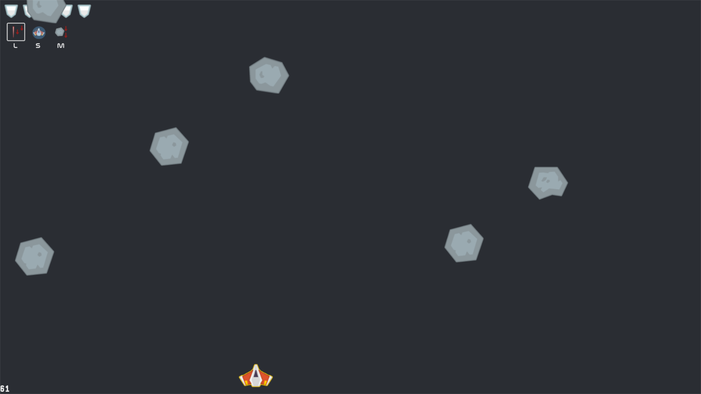
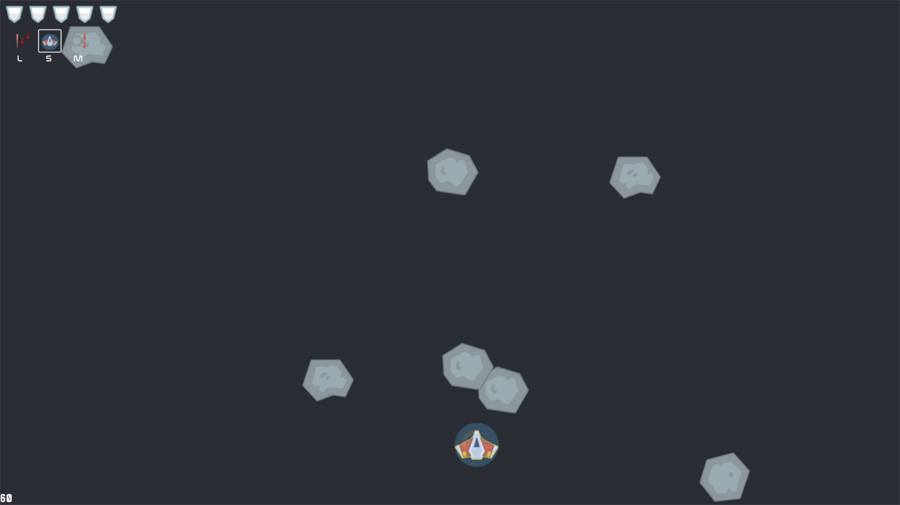
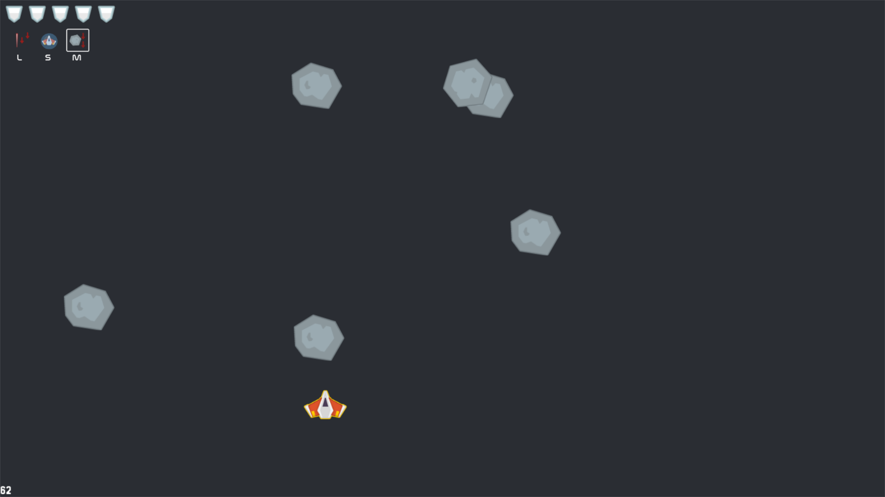
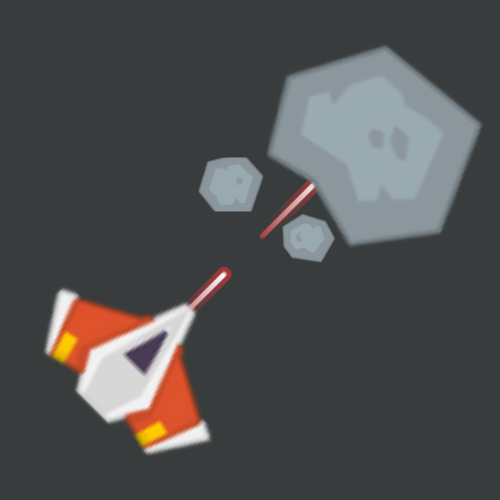

# Meteor Destroy

A casual game made using python, pygame and few other built-in modules


## Screenshots





  
## Demo


## Installation

Installing required package

```pip
  pip install -r requirements.txt
```
    


    
## 🎵 Music
- music credits goes to their owners
[](https://www.youtube.com/watch?v=XZmF30EmY3M)

  